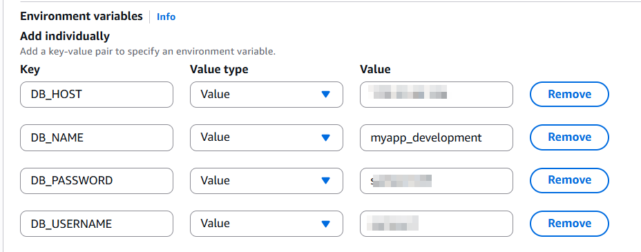

# ECS Fargate Deployment Guide

This guide walks you through deploying a Ruby web application with PostgreSQL database using AWS ECS Fargate.

## Prerequisites
- Ruby application containerized

## Step 1: Create ECR Registry and Upload Docker Image

1. Create ECR Repository

2. Build and Tag Docker Image

3. Push Image to ECR

## Step 2: Create Task Definitions

### Database Task Definition

1. **Create DB Task Definition**
   - Navigate to ECS Console → Task Definitions → Create new task definition
   - Select **Fargate** as launch type
   - Attach **AmazonECSTaskExecutionRolePolicy** to the task role
   

2. **Configure DB Container**
   - Container name: `db`
   - Image: `postgres:15`
   - Port mappings: `5432:5432`
   - Environment variables:
     - `POSTGRES_DB=your_database_name`
     - `POSTGRES_USER=your_username`
     - `POSTGRES_PASSWORD=your_password`
   

### Web Application Task Definition

1. **Create Webapp Task Definition**
   - Select **Fargate** as launch type
   - Attach **AmazonECSTaskExecutionRolePolicy** to the task role
   

2. **Configure Webapp Container**
   - Container name: `web`
   - Image: `<account-id>.dkr.ecr.<region>.amazonaws.com/your-app-name:latest`
   - Port mappings: `3000:3000`
   - Environment variables:
     - `DB_HOST=<db-private-ip>` (to be updated after DB deployment)
     - `DB_PORT=5432`
     - `DB_NAME=your_database_name`
     - `DB_USER=your_username`
     - `DB_PASSWORD=your_password`
   

## Step 4: Create ECS Cluster and Deploy Database Service

1. **Create DB Service**
   - Navigate to your cluster
   - Click **Create Service**
   
   - Select the DB task definition created earlier
   - Choose **Fargate** as launch type
   - Configure networking (VPC, subnets, security groups)
   - Ensure security group allows inbound traffic on port 5432
   

2. **Get DB Container Private IP**
   - After service is running, go to **Tasks** tab
   - Click on the running task
   - Note the **Private IP** of the DB container
   

## Step 5: Update and Deploy Web Application Service

1. **Update Webapp Task Definition**
   - Edit the webapp task definition
   - Update the `DB_HOST` environment variable with the DB container's private IP
   - Create a new revision

2. **Create Webapp Service**
   - Create a new service in the same cluster
   - Select the updated webapp task definition
   - Choose **Fargate** as launch type
   - Ensure security group allows inbound traffic on port 3000

## Step 6: Access Your Application

Once both services are running:

1. **Get Web Application Public IP**
   - Navigate to the webapp task
   - Note the **Public IP** address
   

2. **Access Application**
   - Open browser and navigate to: `http://<webapp-public-ip>:3000`
   - Your Ruby application should be accessible
   

## Troubleshooting

- Verify security group rules and subnet 
- Ensure task execution role has proper permissions
- Confirm environment variables are correctly set
