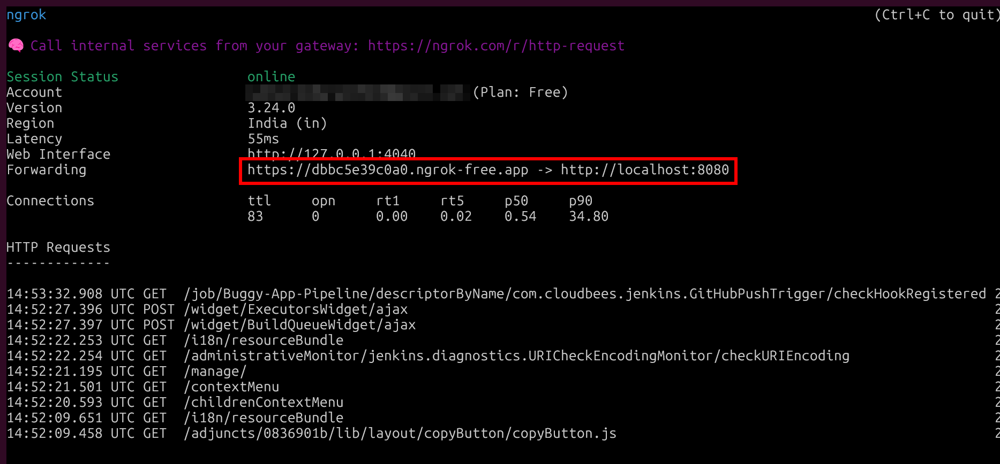
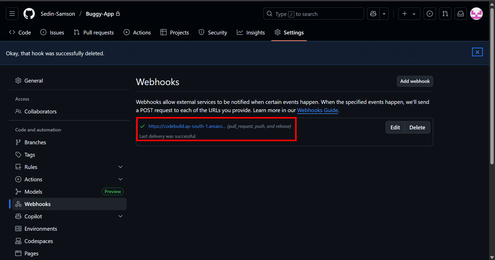
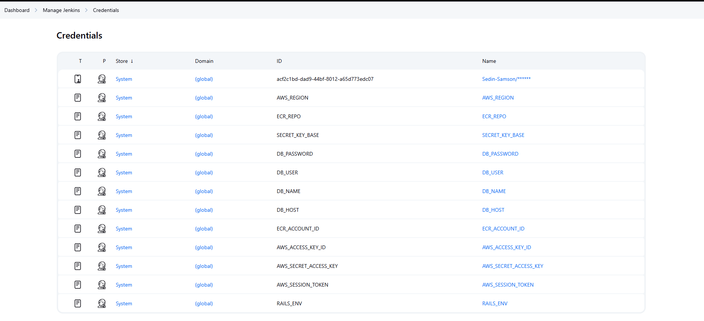
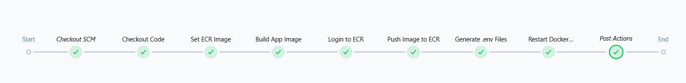

# Jenkins CI/CD Pipeline Setup Guide

## Overview
This guide explains how to set up a complete CI/CD pipeline using Jenkins, Docker, AWS ECR, and GitHub webhooks. The pipeline automatically builds, pushes Docker images to ECR, and deploys a Ruby on Rails application using Docker Compose.

## Prerequisites Setup

### 1. Repository Setup
```bash
git clone https://github.com/Sedin-Samson/Buggy-App.git
cd Buggy-App
git add .
git commit -m "Initial commit with application code"
git push origin master
```

### 2. Local Jenkins Setup
```bash
# Install Jenkins locally
sudo apt update
sudo apt install openjdk-11-jdk
wget -q -O - https://pkg.jenkins.io/debian/jenkins.io.key | sudo apt-key add -
sudo sh -c 'echo deb http://pkg.jenkins.io/debian-stable binary/ > /etc/apt/sources.list.d/jenkins.list'
sudo apt update
sudo apt install jenkins

# Start Jenkins
sudo systemctl start jenkins
sudo systemctl enable jenkins

# Jenkins will be available at http://localhost:8080
```

### 3. Ngrok Setup for Webhook
Since webhooks require HTTPS and we're running Jenkins locally, we use ngrok as a reverse proxy:

```bash
# Install ngrok
sudo apt update && sudo apt install ngrok

# Login to ngrok (get your token from https://dashboard.ngrok.com/get-started/your-authtoken)
ngrok config add-authtoken YOUR_NGROK_TOKEN

# Expose Jenkins on port 8080 via HTTPS
ngrok http 8080
```



This will provide you with a public HTTPS URL like `https://abc123.ngrok.io` that forwards to your local Jenkins.

### 4. GitHub Webhook Configuration
1. Go to your GitHub repository → Settings → Webhooks
2. Click "Add webhook"
3. Set Payload URL to: `https://your-ngrok-url.ngrok.io/github-webhook/`
4. Content type: `application/json`
5. Select "Just the push event"
6. Ensure "Active" is checked
7. Click "Add webhook"


## Jenkins Pipeline Configuration

### Jenkins Credentials Setup
In Jenkins, go to "Manage Jenkins" → "Manage Credentials" → "Global" and add:

- `acf2c1bd-dad9-44bf-8012-a65d773edc07`: GitHub credentials
- `AWS_REGION`: Your AWS region (e.g., us-east-1)
- `ECR_ACCOUNT_ID`: Your AWS account ID
- `AWS_ACCESS_KEY_ID`: AWS access key
- `AWS_SECRET_ACCESS_KEY`: AWS secret key
- `AWS_SESSION_TOKEN`: AWS session token (if using temporary credentials)
- `DB_PASSWORD`: Database password
- `DB_USER`: Database username
- `DB_NAME`: Database name
- `DB_HOST`: Database host
- `RAILS_ENV`: Rails environment (production)
- `SECRET_KEY_BASE`: Rails secret key base


### Jenkinsfile Explanation

#### Pipeline Structure
```groovy
pipeline {
    agent any
    environment {
        IMAGE_TAG = "samson/buggyapp:${BUILD_NUMBER}"
    }
```
- **agent any**: Pipeline can run on any available Jenkins agent
- **IMAGE_TAG**: Creates a unique image tag using the Jenkins build number



#### Stage 1: Checkout Code
```groovy
stage('Checkout Code') {
    steps {
        echo "Cloning source code from GitHub"
        checkout([
            $class: 'GitSCM',
            branches: [[name: '*/master']],
            userRemoteConfigs: [[
                url: 'https://github.com/Sedin-Samson/Buggy-App.git',
                credentialsId: 'acf2c1bd-dad9-44bf-8012-a65d773edc07'
            ]]
        ])
    }
}
```
**Purpose**: Downloads the latest code from the GitHub repository
- Uses stored GitHub credentials for authentication
- Checks out the master branch
- Essential first step for any CI/CD pipeline

#### Stage 2: Set ECR Image
```groovy
stage('Set ECR Image') {
    steps {
        withCredentials([
            string(credentialsId: 'AWS_REGION', variable: 'AWS_REGION'),
            string(credentialsId: 'ECR_ACCOUNT_ID', variable: 'ECR_ACCOUNT_ID')
        ]) {
            script {
                env.ECR_IMAGE = "${ECR_ACCOUNT_ID}.dkr.ecr.${AWS_REGION}.amazonaws.com/${env.IMAGE_TAG}"
                echo "ECR Image set"
            }
        }
    }
}
```
**Purpose**: Constructs the full ECR repository URL
- Combines AWS account ID, region, and image tag
- Creates the complete ECR image path for pushing
- Makes the ECR_IMAGE available to subsequent stages

#### Stage 3: Build App Image
```groovy
stage('Build App Image') {
    steps {
        script {
            echo "Building Docker image for app"
            sh "docker build -f Dockerfile.app -t ${env.ECR_IMAGE} ."
        }
    }
}
```
**Purpose**: Builds the Docker image for the application
- Uses `Dockerfile.app` as the build file
- Tags the image with the ECR repository URL
- Prepares the image for pushing to ECR

#### Stage 4: Login to ECR
```groovy
stage('Login to ECR') {
    steps {
        withCredentials([...]) {
            script {
                echo "Logging in to ECR"
                sh(script: '''
                    export AWS_ACCESS_KEY_ID=$AWS_ACCESS_KEY_ID
                    export AWS_SECRET_ACCESS_KEY=$AWS_SECRET_ACCESS_KEY
                    export AWS_SESSION_TOKEN=$AWS_SESSION_TOKEN
                    aws ecr get-login-password --region $AWS_REGION | \
                    docker login --username AWS --password-stdin $ECR_ACCOUNT_ID.dkr.ecr.$AWS_REGION.amazonaws.com
                ''', label: 'ECR Login')
            }
        }
    }
}
```
**Purpose**: Authenticates Docker with AWS ECR
- Sets AWS credentials as environment variables
- Gets login token from ECR
- Logs Docker into the ECR registry
- Required before pushing images to ECR

#### Stage 5: Push Image to ECR
```groovy
stage('Push Image to ECR') {
    steps {
        echo "Pushing Docker image to ECR"
        sh "docker push ${env.ECR_IMAGE}"
    }
}
```
**Purpose**: Uploads the built image to ECR
- Pushes the tagged Docker image to AWS ECR
- Makes the image available for deployment
- ECR serves as the container registry

#### Stage 6: Generate .env Files
```groovy
stage('Generate .env Files') {
    steps {
        withCredentials([...]) {
            script {
                echo "Generating .env files"
                
                writeFile file: '.env', text: "ECR_IMAGE=${env.ECR_IMAGE}\n"

                writeFile file: '.env.db.production', text: """
                    MYSQL_ROOT_PASSWORD=$DB_PASSWORD
                    MYSQL_DATABASE=$DB_NAME
                    MYSQL_USER=$DB_USER
                    MYSQL_PASSWORD=$DB_PASSWORD
                """.stripIndent()

                writeFile file: '.env.web.production', text: """
                    RAILS_ENV=$RAILS_ENV
                    DB_HOST=$DB_HOST
                    DB_NAME=$DB_NAME
                    DB_USER=$DB_USER
                    DB_PASSWORD=$DB_PASSWORD
                    SECRET_KEY_BASE=$SECRET_KEY_BASE
                """.stripIndent()
            }
        }
    }
}
```
**Purpose**: Creates environment configuration files
- **`.env`**: Contains the ECR image URL for Docker Compose
- **`.env.db.production`**: Database configuration for MySQL container
- **`.env.web.production`**: Application configuration for Rails container
- Uses Jenkins credentials to populate sensitive values securely

#### Stage 7: Restart Docker Compose Services
```groovy
stage('Restart Docker Compose Services') {
    steps {
        echo "Restarting Docker Compose services"
        sh '''
            docker compose down
            docker compose up -d --build
        '''
    }
}
```
**Purpose**: Deploys the new version of the application
- Stops existing containers
- Starts new containers with updated configuration
- `--build` ensures any local changes are incorporated
- `-d` runs containers in detached mode

▶️ [Watch CI-CD Jenkins Demo](images/CI-CD-Jenkins.mp4)


## Docker Compose Configuration

### Web Service Configuration
```yaml
web:
  image: ${ECR_IMAGE}
  ports:
    - "3000:3000"
  depends_on:
    db:
      condition: service_healthy
  env_file:
    - .env.web.production
  healthcheck:
    test: ["CMD", "curl", "-f", "http://127.0.0.1:3000"]
    interval: 10s
    timeout: 5s
    retries: 5
```

**Configuration Breakdown**:
- **image**: Uses the ECR image built and pushed by Jenkins
- **ports**: Maps container port 3000 to host port 3000
- **depends_on**: Ensures database is healthy before starting web service
- **env_file**: Loads environment variables from `.env.web.production`

## Complete Workflow

1. **Developer pushes code** to GitHub repository
2. **GitHub webhook** triggers Jenkins pipeline via ngrok URL
3. **Jenkins pipeline executes**:
   - Downloads latest code
   - Builds Docker image
   - Pushes to AWS ECR
   - Generates environment files
   - Deploys using Docker Compose
4. **Application is live** with new changes

## Security Considerations

- All sensitive data such as passwords and access keys are currently stored as Jenkins credentials. As of now, we only have roles set up we have not created any individual users or user credentials
- ECR provides secure container image storage
- Environment files are generated dynamically and not stored in version control

## Troubleshooting

### Common Issues:
1. **Webhook not triggering**: Check ngrok URL and GitHub webhook configuration
2. **ECR login failures**: Verify AWS credentials and permissions
3. **Docker build failures**: Check Dockerfile.app and build context
4. **Health check failures**: Verify application starts correctly and responds on port 3000