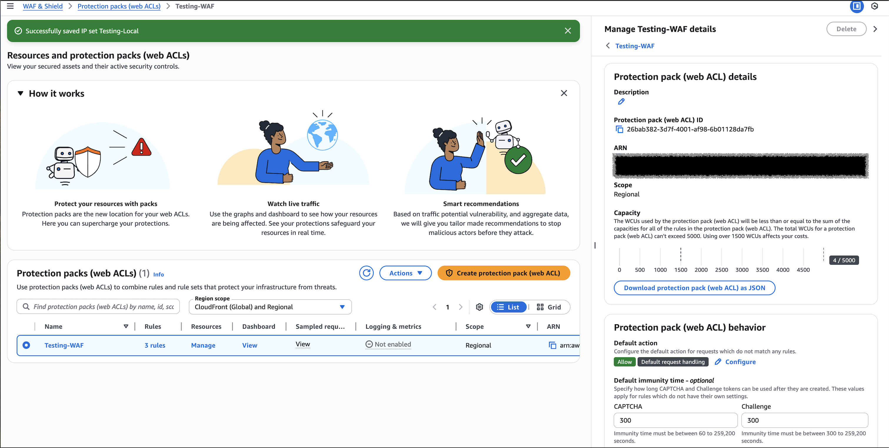
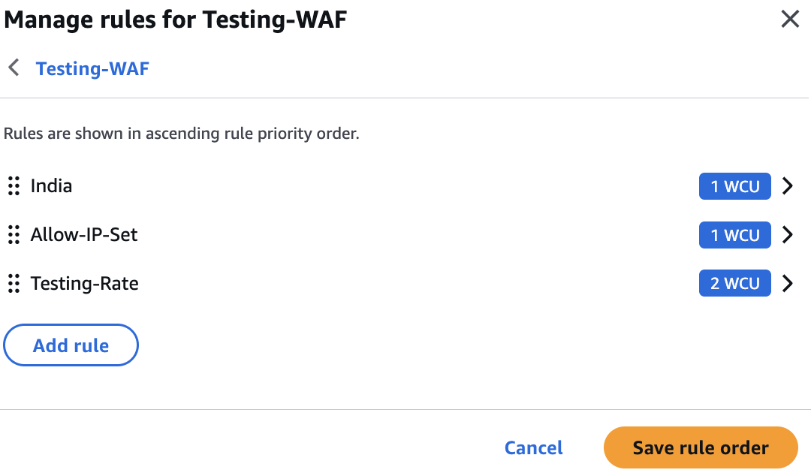
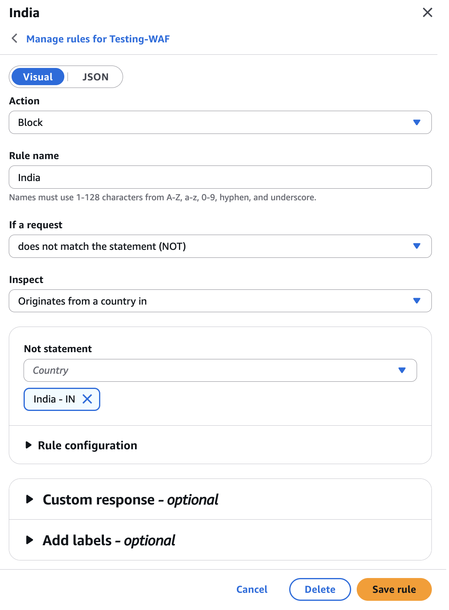
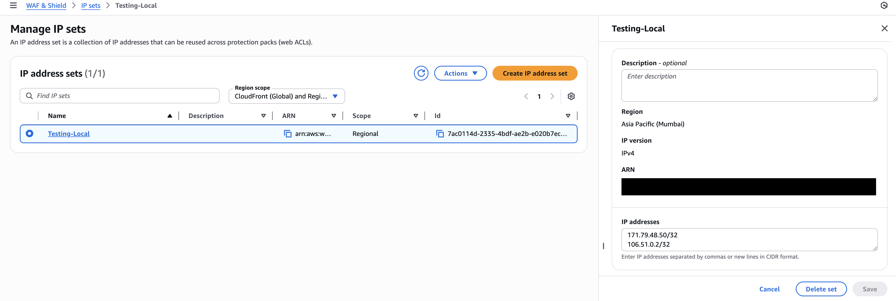
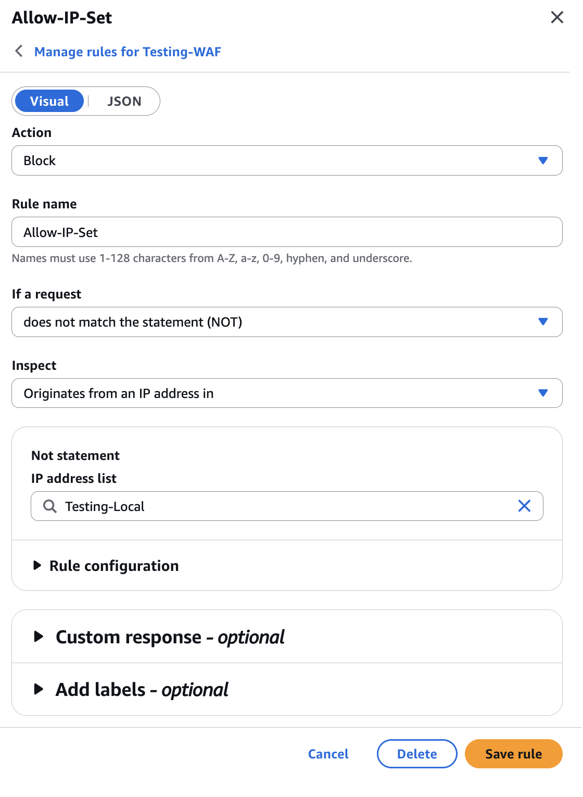
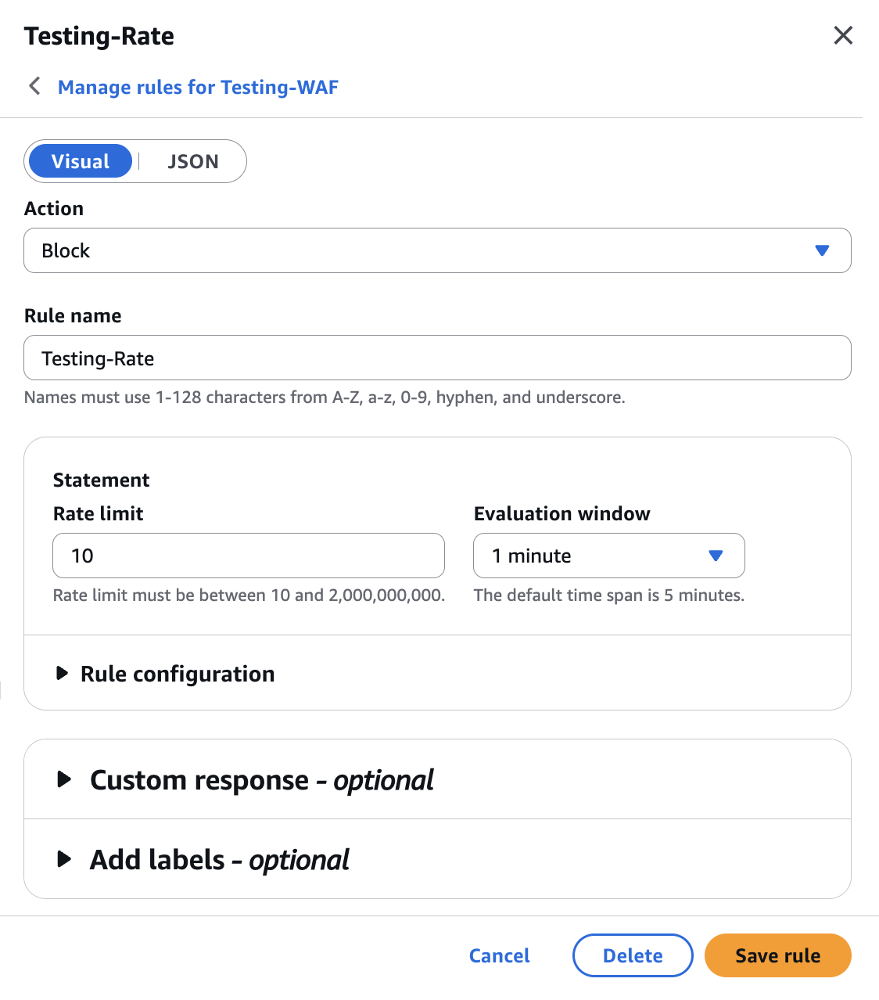
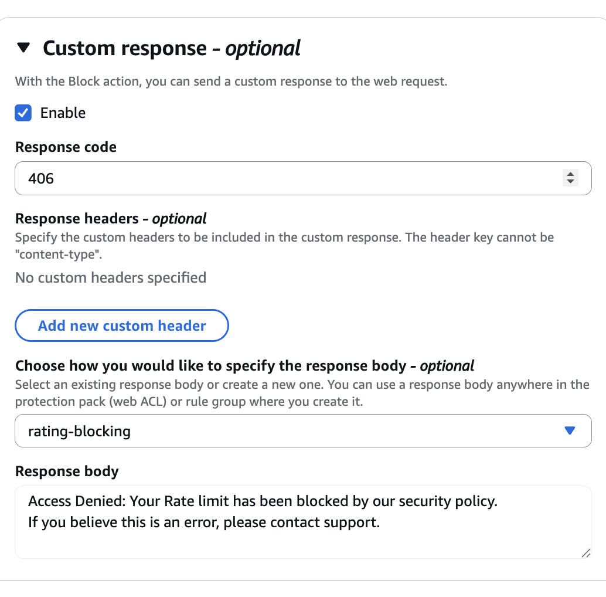
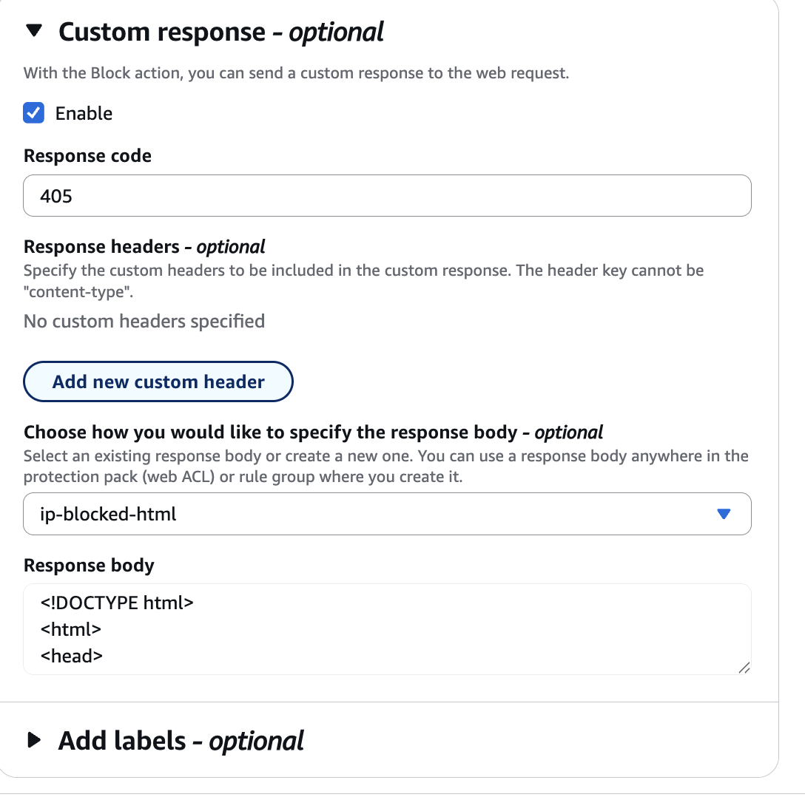

# AWS WAF Rule Group Documentation

## Overview

An **AWS WAF Rule Group** is a reusable collection of WAF rules that helps organize security logic, control capacity usage, and apply the same protection consistently across multiple Web ACLs.  
This setup is designed to **restrict traffic geographically, allow only trusted IPs, and rate-limit abusive requests**, while keeping the default behavior permissive.

Service used: **:contentReference[oaicite:0]{index=0} – AWS WAF**

---

## Objective

- Block traffic from **non-Indian locations**
- Allow access **only from specific trusted IP addresses**
- Protect the application from **high-rate requests (DDoS / abuse)**
- Provide a **custom HTML response** when traffic is blocked

---

## Rule Evaluation Logic (High Level)

AWS WAF evaluates rules **top to bottom (by priority)**.  
The **first matching rule decides the action**.  
If no rule matches, the **Default action is applied**.

**Default Action:** `ALLOW`


---

## Rule Priority & Behavior

### Priority 1: Block Non-Indian Traffic

**Rule Name:** `Block-Non-India`  
**Type:** Geo match rule  
**Action:** `BLOCK`

**Logic:**
- If the request **does NOT originate from India (IN)** → **BLOCK**
- If request is from India → Continue to next rule

**Purpose:**  
Restricts access to Indian traffic only.

---

### Priority 2: Allow Only IPs in IP Set

**Rule Name:** `Allow-IP-Set`  
**Type:** IP set match (with NOT condition)  
**Action:** `BLOCK`

**Logic:**
- If request **IP is NOT present** in the `Testing-Local` IP set → **BLOCK**
- If IP is present → Continue to next rule

**Purpose:**  
Allows access only from explicitly trusted IP addresses.



---

### Priority 3: Rate Limiting

**Rule Name:** `Testing-Rate`  
**Type:** Rate-based rule  
**Threshold:** `10 requests per minute per IP`  
**Action:** `BLOCK`

**Logic:**
- If a single IP sends **more than 10 requests in 1 minute** → **BLOCK**
- Otherwise → Continue

**Purpose:**  
Prevents abuse, brute force attempts, and basic DDoS patterns.


---

## Default Action

**Default:** `ALLOW`

**Meaning:**  
If a request:
- Comes from India  
- Is from an allowed IP  
- Is under the rate limit  

→ The request is **allowed**.

---

## Summary Table

| Priority | Rule Name        | Condition                                    | Action |
|--------:|------------------|-----------------------------------------------|--------|
| 1       | Block-Non-India  | Request NOT from India                        | BLOCK  |
| 2       | Allow-IP-Set     | IP NOT in `Testing-Local` IP set              | BLOCK  |
| 3       | Testing-Rate     | More than 10 requests per IP per minute       | BLOCK  |
| —       | Default          | No rule matched                               | ALLOW  |

---

## Custom Block Response Template

The following HTML page is returned whenever a request is blocked by any rule:

```html
<!DOCTYPE html>
<html>
<head>
  <title>Access Blocked</title>
  <style>
    body {
      font-family: Arial, sans-serif;
      background-color: #f4f6f8;
      text-align: center;
      padding-top: 80px;
    }
    .box {
      background: #ffffff;
      padding: 30px;
      margin: auto;
      width: 420px;
      border-radius: 8px;
      box-shadow: 0 2px 8px rgba(0,0,0,0.1);
    }
    h1 { color: #d9534f; }
  </style>
</head>
<body>
  <div class="box">
    <h1>Access Denied</h1>
    <p>Your IP address has been blocked by our security system.</p>
    <p>If you believe this is an error, please contact the administrator.</p>
  </div>
</body>
</html>

```
## Example Template




